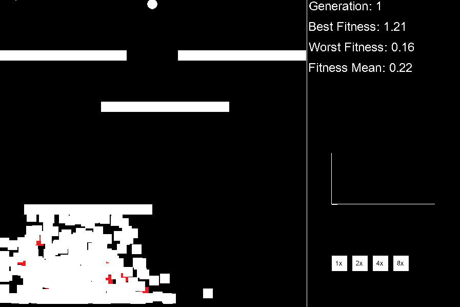
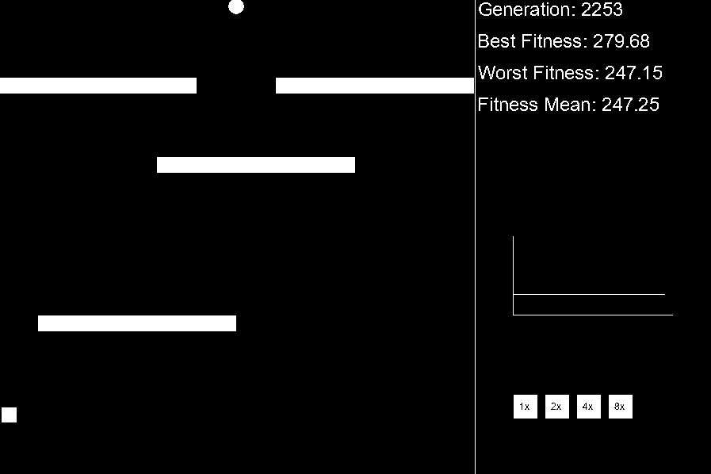

# Genetic-Algorithm

This repository contains an visual thing about genetic algorithmns, applying the concept of crossover and mutation in an spaceship

### How This Works

The game starts with n spaceships (Squares), and every spaceship has random genes, where genes like 0, means go forward, 1 means go backward, and so on for left, right and do nothing. The fitness metrics are the inverse of the euclidian distance between the center top of the spaceship and the center of the finish square. After the time of 200 ticks, the system make a crossover between the best gene to all the other, followed by and mutation.

Here's some gifs of the starts, and after some generations, look:

